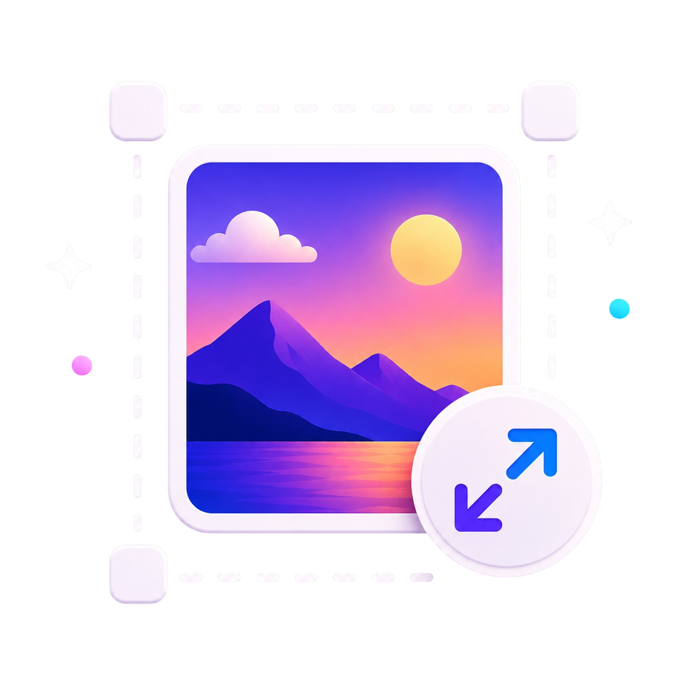

# 🖼️ Photo Resizer

  
   
   
  
**Photo resizer and compressor with advanced scaling**
  
  
  

A professional, offline-first Android application designed to resize, crop, and optimize images to fit strict file size (KB/MB) and pixel dimension requirements. Built entirely with **Kotlin**, **Jetpack Compose**, and **Material Design 3 (M3)**, this application executes all optimization iterations entirely client-side for maximum speed and absolute privacy.

---

## ✨ Features

- 🖼️ **Flexible Source Options**: Seamlessly choose images from the system library or capture a high-quality photo directly via the built-in system camera integration.
- 📐 **Interactive Cropping & Rotation**: Precise crop adjustment, aspect ratio locks (1:1, 4:3, 16:9, etc.), and loss-free 90-degree rotations.
- 🟡 **Freeform Cropping Mode**: An advanced, completely unrestricted cropping mode allowing custom crop bounds adjustment by dragging interactive corner handles highlighted with vibrant gold borders.
- 📑 **Advanced Sizing Modes & Resolution Preservation**: Three user-focused workflows designed for diverse requirements:
  - **Custom Size**: Overriding target resolutions directly in pixels.
  - **Preset Size**: Standard administrative document sizes configured in physical dimensions. Choose between **Maximum Resolution** (which retains original pixel details and matches only the aspect ratio to preserve quality) and **Original Preset Size** (which rescales the image to exact dimensions).
  - **Aspect Ratio**: Restricting proportions to classic scales.
- 📏 **Standard Passport & Document Presets**: Instant dimension configurations tailored for visas, passports, and identity cards in millimeters (e.g., 25x35 mm, 35x45 mm, 50x50 mm, 51x51 mm / 2x2 in) or custom millimeter sizing.
- ⚖️ **Target KB/MB Compressor**: Enter a strict upper limit (e.g., *under 100 KB*) and our background optimization engine automatically searches for the highest-possible quality setting that satisfies the target. Supports both KB and MB constraints.
- 💾 **Automatic Source Format Preservation & Multi-Format Export**: Intuitively detects the source format of imported images (e.g., PNG, WEBP, or JPG) and defaults the processing and saving stream to match it. Export and save your optimized images in high-compatibility **JPG**, lossless **PNG**, or modern highly-efficient **WEBP** formats.
- 📊 **Real-time Comparative Statistics**: Side-by-side metric comparison of the original image and the optimized result, showing resolution, aspect ratio, format, and precise computed output file size.
- 🚀 **Dynamic Launcher Shortcuts**: Two fast-access shortcuts (**Open Main Screen** and **Open Setting**) directly from the home screen icon to let you jump exactly where you need to go instantly.
- 🌈 **Advanced Styling & Theme Engine**: Preferred Theme Modes (System, Light, Dark), pitch-black **AMOLED Black Mode** to save battery, and 5 bespoke accent palettes (Emerald, Blossom, Ocean, Amber, Coral) alongside Material 3 Dynamic colors.
- ❄️ **Interactive Seasonal Particle Effects**: Beautiful, touch-responsive seasonal simulations that render falling snow, blossom petals, summer sparkles, monsoon rain, or autumn leaves in real-time, complete with customizable automatic or manual controls.
- 📖 **Enhanced Readability & Large Typography**: Upgraded settings text size constraints (Categories, Item Cards, Dialogs, Buttons, and Switch labels) for easier visual scanning, better contrast, and enhanced accessibility.
- 🔄 **Intelligent Navigation Flows & Maximum Quality Processing**: Fully-implemented Gesture/Hardware Back button interceptor (`BackHandler`) for sub-screens (like the Style selector) to prevent unexpected app closures. When size limits are not specified, images are processed at a full **100** compression factor to guarantee maximum quality.
- ⚡ **Lightning Fast & Secure**: No servers or external APIs are used during the compression. Your personal photos never leave your device.

---

## 🖼️ Screenshots

| ![ss-1] | ![ss-2] | ![ss-3] |
| :------: | :------: | :------: |
| ![ss-4] | ![ss-5] | ![ss-6] |
| ![ss-7] | ![ss-8] |

[ss-1]: screenshots/1.jpg
[ss-2]: screenshots/2.jpg
[ss-3]: screenshots/3.jpg
[ss-4]: screenshots/4.jpg
[ss-5]: screenshots/5.jpg
[ss-6]: screenshots/6.jpg
[ss-7]: screenshots/7.jpg
[ss-8]: screenshots/8.jpg

---

## 🛠️ Stack & Technologies

- **Language:** 100% Kotlin
- **UI Framework:** Jetpack Compose (Declarative UI)
- **Design System:** Material Design 3 (M3)
- **Asynchronous/State Handling:** Kotlin Coroutines & Flow API
- **Local Settings:** Clean key-value persistence manager for user preferences
- **Jetpack Utilities:** AndroidX Activity, Graphics, and modern launcher-based permissions

---

## 📫 Feedback & Support

- Suggestions or feature requests? [Open an issue](https://github.com/ShafiqulIslamShamim/Photo-Resizer/issues) or contact the developer.

---

## 🪪 License

Copyright © 2026 Shafiqul Islam Shamim. All Rights Reserved.

This repository and all of its contents, including source code, documentation, configuration files, and other assets, are protected by copyright.

No permission is granted to use, copy, modify, merge, publish, distribute, sublicense, sell, create derivative works from, or otherwise exploit any part of this repository without the prior written permission of the copyright holder.

The repository is publicly accessible on GitHub for viewing and collaboration only. Public availability does not grant any license or permission to use or redistribute the source code.

For licensing inquiries or permission requests, please contact the copyright holder.

---

## 🙌 Contributions

Pull requests are welcome!  
Fork the repo, make your changes, and submit a PR.  
Let’s make **Photo Resizer** even more powerful together.

---

## Get it from

---

